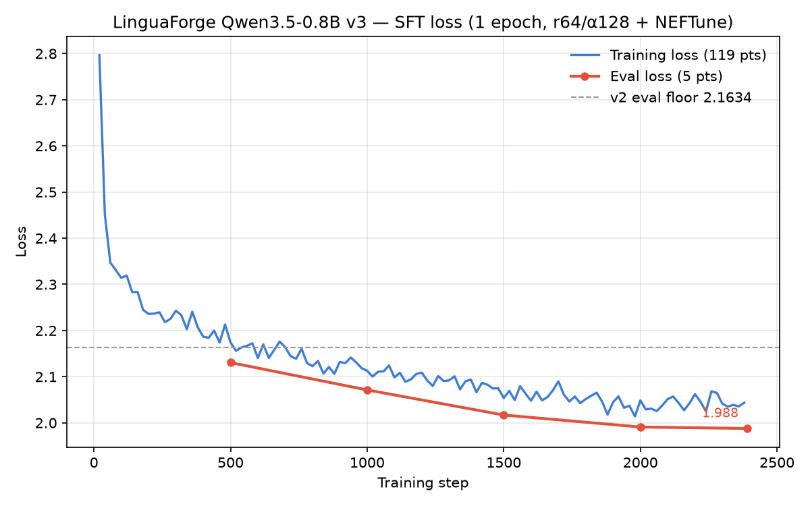

# LinguaForge — Qwen3.5-0.8B 繁中／英／日翻譯特化模型

把 `Qwen/Qwen3.5-0.8B`（873M）以 LoRA SFT 微調成 **繁體中文（臺灣）↔ 英文 ↔ 日文** 六方向翻譯特化小模型。全程在單張消費級顯示卡上完成（出貨版 v5e：RTX 5060 Ti 16GB、peak VRAM 4.0GB、10.5 小時）。

> 🤗 **模型權重（出貨 v5e）**：[Hugging Face · `RX5950XT/LinguaForge-Qwen3.5-0.8B-zhTW-en-ja`](https://huggingface.co/RX5950XT/LinguaForge-Qwen3.5-0.8B-zhTW-en-ja)
> — LoRA adapter、合併 bf16、GGUF（Q8_0 / Q4_K_M / f16）、[模型卡](https://huggingface.co/RX5950XT/LinguaForge-Qwen3.5-0.8B-zhTW-en-ja/blob/main/README.md)。
> 本倉庫是訓練與評測的完整程式碼；權重鏡像在本機 `release/`（gitignored）。

## 動機

0.8B 這種尺寸的語意理解其實不差（零樣本 COMET 84.64），但輸出的**字形與用語**不對：翻成中文時大量摻簡體字（FLORES ja→zhtw 高達 **43.6%** 的行）。這類問題正是 SFT 最能補的部分——出貨版把兩個 →zhtw 方向的洩漏壓到 **1.09% / 0.69%**，同時六方向語意分數不降反升。

## 成績（出貨版 v5e）

FLORES-200 devtest **全量 n=1012**，beam=4 + 逐目標語言解碼；對照組是**同樣本數、同解碼設定**的官方模型。

| 方向 | chrF++ (base→v5e) | BLEU (base→v5e) | COMET (base→v5e) | 簡體洩漏 (base→v5e) |
|---|---|---|---|---|
| en→zhtw | 19.38 → 20.26 | 25.57 → 28.90 | 86.32 → 86.23 | **10.18% → 1.09%** |
| zhtw→en | 47.78 → 50.33 | 19.34 → 23.72 | 84.79 → **85.27** | — |
| en→ja | 20.26 → 24.15 | 19.81 → 22.65 | 86.17 → **88.44** | — |
| ja→en | 45.67 → 50.17 | 16.67 → 22.70 | 84.85 → **86.20** | — |
| ja→zhtw | 10.53 → 16.60 | 10.38 → 23.07 | 81.44 → **86.10** | **43.58% → 0.69%** |
| zhtw→ja | 14.80 → 18.48 | 12.97 → 16.93 | 84.24 → **87.14** | — |
| **均值** | 26.40 → **30.00** | 17.46 → **22.60** | 84.64 → **86.56** | |

> **en→zhtw 是持平不是輸**：paired bootstrap 95% CI [−0.414, +0.225] 跨 0。
> 而官方那 86.32 是在 10.18% 洩漏下拿到的（COMET 對簡繁不敏感），兩邊產出的不是同一種東西。

通用能力用**外部公開基準**驗（不是只有翻譯分數）：BELEBELE 三語 **57.28 / 52.36 / 62.81**、
知識軸（TMMLU+ / MMMLU-JA / MMLU）**30.53 / 36.64 / 43.81**，**六格全部 ≥ base**。
長文件翻譯行數對齊比精準 1.000、腰斬率 0~4%——v2/v3 的「長文只翻前兩段」已修掉。

完整分析（含 v1→v5f 每一版做了什麼、被推翻的假設、量測方法論）見 **[`docs/REPORT.md`](docs/REPORT.md)**。

## 環境需求

- Windows 11 / Python 3.12 / [uv](https://docs.astral.sh/uv/)
- NVIDIA GPU ≥ 8GB VRAM（CUDA 12.8）

```powershell
uv sync                          # 主環境（訓練、推論、評測）
uv sync --project tools/comet    # COMET 評分隔離環境
```

> `unbabel-comet` 會鎖住舊版 transformers，與 Qwen3.5 所需的 5.x 衝突，因此獨立成子專案。
> Windows 上另**必裝** `triton-windows` + `flash-linear-attention`，否則線性注意力退回
> `torch_chunk_gated_delta_rule`，bs8×seq1024 直接要 38GB 而 OOM。

## 快速開始

```powershell
uv run python scripts/download_data.py                                       # 下載平行語料（冪等）
uv run python scripts/prepare_data.py --limit 80000 --dev-from data/sft/dev.jsonl   # 清洗 → data/sft/*.jsonl
uv run python scripts/train_sft.py --config configs/sft_lora_v5e.yaml        # LoRA SFT（~10.5h）
uv run python scripts/evaluate.py --tag v5e --adapter outputs/sft-v5e --full  # 六方向 + 洩漏
uv run --project tools/comet python tools/comet/score.py --tag v5e-flores    # COMET（全名，非版本號）
uv run python scripts/eval_bench.py      --tag v5e --adapter outputs/sft-v5e  # BELEBELE + 知識
uv run python scripts/eval_capability.py --tag v5e --adapter outputs/sft-v5e --axis all
uv run python scripts/regression_guard.py --candidate v5e                    # 出貨硬閘，exit 0 才可出
```

## 出貨硬閘

六條門檻**全部機器判定**，`regression_guard.py` 一次跑完 28 格；
**exit 0=PASS／1=FAIL／2=缺值**。缺值跟 PASS 分開——沒跑過的閘不算過，不靠人工核對表格。

| 項目 | 門檻 |
|---|---|
| 簡體洩漏 en→zhtw / ja→zhtw | ≤ base + 0.3 |
| 六方向 COMET | 每個不得**顯著**低於 base（三段判定，見下） |
| 翻譯機率（通用題被當翻譯題作答） | ≤ 5.0% |
| BELEBELE / 知識 三語 | 各 ≥ base − 3.0 |
| 長文尾段譯出比 `tail_ratio_median` | ≥ 0.80（六向皆須） |
| 長文腰斬率 `truncated_pct` | ≤ 5%（六向皆須） |

COMET 是三段判定：`≥ base` PASS；落在 `[base−0.5, base)` 判 **TIE?**，必須跑
`tools/comet/paired_bootstrap.py`，**95% CI 跨 0 才算過**；`< base−0.5` 直接 FAIL。
理由：`system_score` 是 n≈1000 段的平均，±0.4 在雜訊帶內，拿點估計判「−0.09 就是退步」
等於對雜訊做決策——本專案兩次誤判都是這樣來的。

實跑結果：**v5e exit 0（28 格全 PASS）**；v5f exit 1（BELEBELE 中日文 −4.53 / −7.84）。

## 專案結構

大檔（語料、權重、GGUF）不進版控——見下方[「哪些東西不在這個倉庫」](#哪些東西不在這個倉庫)。

```
├─ README.md                  本文件
├─ CLAUDE.md / AGENTS.md      給 AI agent 的專案工作規範（含出貨標準）
├─ CONTEXT.md                 開發交接紀錄（接手先讀）
├─ LICENSE                    Apache-2.0
├─ pyproject.toml / uv.lock   主環境依賴（訓練 + 推論 + 評測）
│
├─ docs/
│    ├─ REPORT.md               研究報告：v1→v5e 全紀錄、通用能力、量測方法論、收工判斷
│    ├─ RESEARCH-v5.md          v5 逐項發現的原始紀錄（含被推翻的中間結論）
│    └─ assets/loss_curve.png   v5e SFT train/eval loss 雙曲線
│
├─ configs/                   訓練設定（每版一個檔，不改舊檔）
│    ├─ sft_lora_v5e.yaml        **出貨版**：r64/α128、1 epoch、503k 筆
│    ├─ sft_lora_v5f.yaml        r128/α256 對照（COMET 較高但踩硬閘，不出貨）
│    ├─ sft_lora.yaml            當前預設（可變動）
│    ├─ sft_lora_v3.yaml / sft_lora_v4.yaml   歷史版本
│    └─ sft_qlora_2b.yaml        2B NF4 4-bit QLoRA（能力 vs 資料診斷）
│
├─ scripts/                   資料管線 → 訓練 → 評測 → 打包，一條線
│    ├─ download_data.py        下載平行語料（冪等，可中斷重跑）
│    ├─ prepare_data.py         清洗 → 注水式配額 → LaBSE 語意過濾 → s2twp → 污染閘
│    ├─ bitext_filter.py        LaBSE 雙語相似度快取（data/labse/*.npz）
│    ├─ build_replay.py         通用指令 replay（oasst2 / aya，Apache-2.0）
│    ├─ dump_eval_lines.py      抽 5 基準全量行 → 污染閘比對表
│    ├─ inspect_sft.py / count_tokens.py      抽看樣本、估 token 預算
│    ├─ bench_step.py           量 VRAM/吞吐選 micro-batch（防 Windows 靜默 fallback）
│    ├─ train_sft.py            LoRA / QLoRA 訓練（token 預算組批、可 resume）
│    ├─ evaluate.py             六方向翻譯 + chrF++/BLEU/洩漏率；DECODE 是解碼唯一真相來源
│    ├─ eval_capability.py      行為三軸：文件級完整度 / ifeval / 通用能力保留
│    ├─ eval_bench.py           BELEBELE + TMMLU+/MMLU/MMMLU-JA（選項輪轉去偏）
│    ├─ eval_gguf.py            量 GGUF 出貨路徑（llama-cli，greedy）
│    ├─ scoreboard.py           方向 × 基準矩陣
│    ├─ regression_guard.py     **六條出貨硬閘全機器化，exit 0/1/2**
│    ├─ export_model.py / verify_merged.py    合併 LoRA → bf16 全模型 + 抽測
│    ├─ export_gguf.py          bf16 → GGUF（主檔須 --no-mtp）→ Q8_0/Q4_K_M
│    ├─ plot_loss.py            loss 雙曲線（uv run --with matplotlib，不污染主環境）
│    └─ test_*.py               不需 GPU 的自檢（清洗／評測／守門邏輯）
│
├─ tools/comet/               COMET 隔離子專案（獨立 uv 環境，鎖 transformers<4.58）
│    ├─ score.py                reference-based COMET，分數寫回 results/*.json
│    ├─ paired_bootstrap.py     配對 bootstrap CI → results/bootstrap/*.json（硬閘會讀）
│    └─ kiwi.py                 CometKiwi reference-free（gated、非商用，僅評測）
│
├─ results/                   評測結果（進版控的實驗證據）
│    ├─ baseline/               官方零樣本地板；**base-full-flores.json 是唯一可用的 COMET 對照**
│    ├─ v1/ v2/ v3/ v3-2b/ v4/ v5/    各版 <tag>-<benchmark>.json
│    ├─ bench/ capability/ bootstrap/ 通用能力、行為三軸、顯著性 CI
│    ├─ v5/v5e-trainer_state.json     出貨版 loss 歷史（plot_loss.py 讀這個）
│    ├─ data_stats.json         每來源清洗統計 + 方向/領域實際配比
│    └─ hyp/      (git-ignored) 各方向 src/ref/hyp 譯文，evaluate.py 可重跑產生
│
├─ tasks/         todo.md（現況與未解項）、lessons.md（踩坑教訓）
├─ data/          (git-ignored) raw/ 原始 tsv、sft/ 訓練 jsonl、flores200/、labse/ 快取
├─ outputs/       (git-ignored) 訓練產物：sft-v3 … sft-v5f、merged/
├─ release/       (git-ignored) HF 上傳鏡像，見[發布](#發布)
└─ logs/          (git-ignored) 執行 log：data/ bench/ train/ eval/ comet/ export/
```

> `results/*.json` 沿用 `<tag>-<benchmark>.json` 慣例；分類子目錄由讀取端遞迴讀取（`rglob`），放哪層都找得到。

### 哪些東西不在這個倉庫

| 排除 | 大小 | 怎麼拿回來 |
|---|---|---|
| `data/` | ~2 GB | `download_data.py` + `prepare_data.py` 重建（語料授權各異，不 re-host） |
| `outputs/` | ~10 GB | 重訓；v5e adapter 在 `outputs/sft-v5e`，loss 歷史在 `results/v5/v5e-trainer_state.json` |
| `release/` | 4.5 GB | HF model repo 鏡像（見[發布](#發布)） |
| `results/hyp/` | ~35 MB | `evaluate.py --tag <tag>` 重跑 |
| `logs/` | 3 MB | 純執行紀錄；有價值的數字已全數提煉進 `results/` 與 `docs/REPORT.md` |

## 資料

v5e 六方向各 ~80,000、合計 **502,993** 句，外加通用指令 replay 35,177 筆（dev 1,200，跨版凍結）。
每來源設佔比上限並標領域，避免單一語料壟斷某方向。

| 來源 | 用於 | 說明 |
|---|---|---|
| COCT（Taiwan Panorama） | en↔zhtw | 原生臺灣正體，品質最佳 |
| TED2020 | en↔zhtw、ja↔zhtw、en↔ja | 演講字幕，乾淨完整句 |
| WikiMatrix / JParaCrawl / KFTT / Tatoeba / News-Commentary | en↔ja | 書面體乾淨語料 |
| GlobalVoices（原生繁新聞）/ KDE4（原生繁 IT） | en↔zhtw、ja↔zhtw | 補新聞與在地化語域 |
| OpenSubtitles / MTNT | 僅 →en 的源側 | 救 into-English；只進源側以護洩漏戰果 |
| OPUS-100 | en↔zhtw | 量大但雜訊較多 |
| oasst2 / aya_dataset（Apache-2.0） | replay | 通用指令，防災難性遺忘 |

清洗流程：控制字元正規化 → 字幕雜訊剝除 → 長度與長度比過濾 → 語言驗證 →
**LaBSE 雙語語意過濾（≥0.65）** → **OpenCC `s2twp` 統一臺灣正體** → CJK 間空白／全形標點修正 →
去重 → **免污染閘**（hash 5 個評測基準的個別語言行共 33,984 行，訓練對任一側命中即丟）→
**注水式來源配額**（句級與文件級共用預算，小池子取不滿的餘額讓給大池子）。
每來源統計與方向/領域實際配比寫入 `results/data_stats.json`。

> 規則式清洗抓不到「兩句根本沒關係」：LaBSE 掃全 20 份語料發現 `globalvoices.ja-zhtw`
> 有 64.7% 的行相似度低於 0.60（`jparacrawl` 只有 0.8%），而錯位率與各方向成績完全單調對應。

## 訓練設定

LoRA target 涵蓋標準注意力、MLP 與 Qwen3.5 的**線性注意力層**（`in_proj_qkv/z/a/b`、`out_proj`）；
bf16、**不用 packing**、token 預算組批、`max_length` 1408、lr 1e-4 cosine、單 epoch。

| config | 模型 | 設定 | 產出 |
|---|---|---|---|
| **`sft_lora_v5e.yaml`** | 0.8B | **r64/α128、1 epoch、503k 筆** | `outputs/sft-v5e`（**出貨**） |
| `sft_lora_v5f.yaml` | 0.8B | r128/α256（COMET +0.18 但踩硬閘） | `outputs/sft-v5f` |
| `sft_lora_v3.yaml` | 0.8B | r64/α128 + NEFTune、1 epoch | `outputs/sft-v3` |
| `sft_qlora_2b.yaml` | 2B | NF4 4-bit QLoRA | `outputs/sft-2b-qlora` |

實際成本（v5e，單張 RTX 5060 Ti 16GB）：**peak VRAM 4.00GB、10.5 小時**、5,677 步、final eval_loss **1.7708**。



> **顯存陷阱**：Qwen3.5 的 vocab 高達 248K，logits 物化使 VRAM 隨 batch×seq 暴增
> （~3.3MB/token）。Windows 超顯存**不會 OOM**，NVIDIA 驅動會靜默 fallback 到系統記憶體、
> 速度掉到 1/5 且無警告——長跑前務必用 `scripts/bench_step.py` 量實際 VRAM。
> 同理，任何只要最後一格 logits 的 forward 都要設 `logits_to_keep=1`（實測峰值 15.85 → 2.29GB）。

## 發布

出貨 **0.8B v5e**。程式碼與實驗證據在 GitHub；權重與模型卡在 Hugging Face
（**皆已公開**）。兩邊互相連結：

| 位置 | 內容 |
|---|---|
| [**Hugging Face**](https://huggingface.co/RX5950XT/LinguaForge-Qwen3.5-0.8B-zhTW-en-ja) | LoRA adapter、合併 bf16、GGUF、[模型卡 README](https://huggingface.co/RX5950XT/LinguaForge-Qwen3.5-0.8B-zhTW-en-ja/blob/main/README.md) |
| [**GitHub（本倉庫）**](https://github.com/RX5950XT/LinguaForge-Qwen3.5-0.8B-zhTW-en-ja) | 訓練／評測程式、config、`results/`、[`docs/REPORT.md`](docs/REPORT.md)；語料不 re-host |
| 本機 `release/` | 與 HF model repo 同結構的上傳鏡像（gitignored） |

`release/` 就是 HF model repo 的完整鏡像，目錄結構即上傳後的樣子——adapter 放根目錄
（`library_name: peft` 要求），模型卡是 **`README.md`**（HF 只渲染這個檔名，且需 YAML frontmatter）：

```
release/
├─ README.md                     模型卡（frontmatter: apache-2.0 / base_model / pipeline_tag: translation）
├─ .gitattributes                *.safetensors、*.gguf 走 LFS
├─ adapter_model.safetensors     LoRA r64/α128（173MB）
├─ adapter_config.json           base = Qwen/Qwen3.5-0.8B
├─ tokenizer.json / tokenizer_config.json / chat_template.jinja
├─ assets/loss_curve.png         模型卡內嵌
├─ merged-bf16-v5e/              合併全模型 1.7GB（免裝 peft，可直接轉檔）
└─ gguf-v5e/                     Q8_0 812M / Q4_K_M 529M / f16 1.5G
```

打包流程：

```powershell
uv run python scripts/export_model.py --adapter outputs/sft-v5e --out release/merged-bf16-v5e
uv run python scripts/export_gguf.py --llama-cpp <llama.cpp> --quantize-bin <llama-quantize>
uv run --with matplotlib python scripts/plot_loss.py --out release/assets/loss_curve.png
hf upload <repo-id> release/ .
```

GGUF 實測（RTX 5060 Ti）：Q8_0 **186 t/s**、Q4_K_M 171–217 t/s（`-ngl 99`）。
**llama-cli 必須加 `--reasoning off --reasoning-budget 0`**（舊的 `--chat-template-kwargs
enable_thinking` 已被靜默忽略，thinking 會以雜訊前綴洩進譯文），CJK 提示詞用 `-f prompt.txt`
不要用 `-p`（cp950 會打壞）。GGUF 走 greedy，**務必補 OpenCC `s2twp` 後處理**——
實測簡體洩漏 2.00% → 0.00%。推論範例與 `eos_token_id=[248046,248044]` 等關鍵旗標詳見 `release/README.md`。

## 授權

模型與程式碼依 Apache-2.0；各語料授權依其原始來源（本倉庫僅發布微調權重，不轉發語料）。
